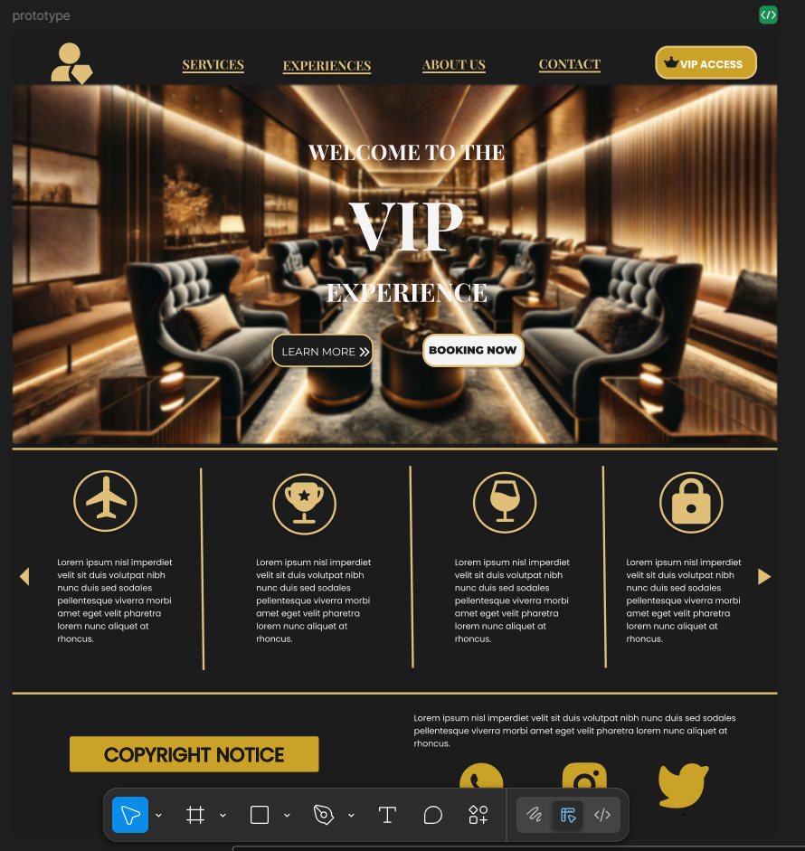
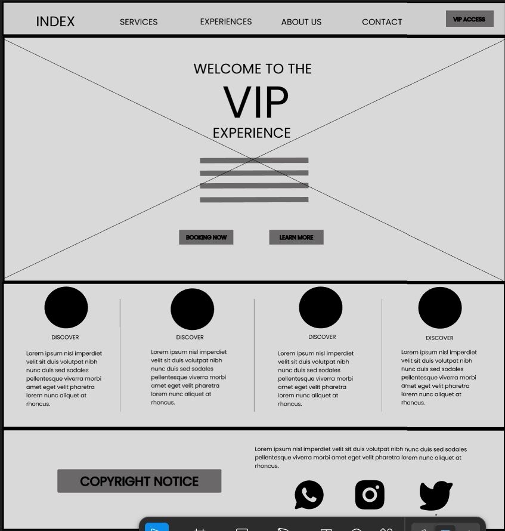
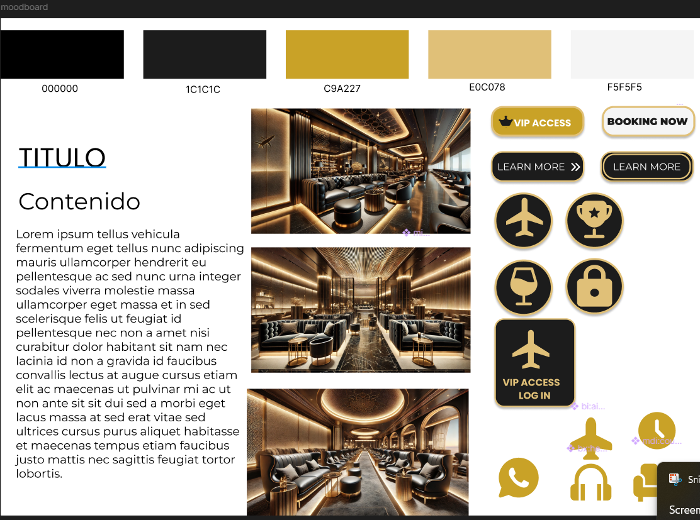
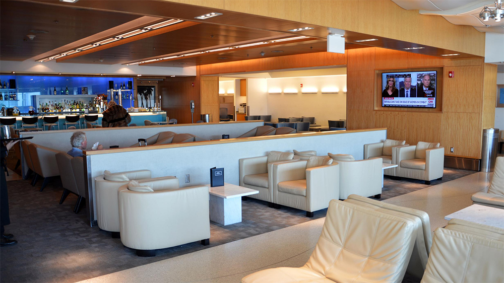

# BIT-1. Project

# 🌟 VIP Lounge Experience 🌟

Welcome to **VIP Lounge Experience**! This project is designed to provide a premium user experience, showcasing exclusive services, VIP lounges, and a modern, responsive interface.

---

## 📋 Project Description

**VIP Lounge Experience** is a web application that allows users to explore exclusive services, book VIP experiences, and learn more about luxurious lounges. The design is fully responsive, ensuring a seamless experience across all devices.

---

## 🚀 Features

- **Responsive Design**: Optimized for mobile, tablet, and desktop devices.
- **Modern Interface**: Elegant colors and premium typography.
- **Interactive Modal**: Quick access to VIP options through a dynamic modal.
- **Clear Navigation**: Intuitive navbar with links to key sections.
- **Informative Footer**: Organized and professional footer layout.

---

## 🛠️ Technologies Used

- **HTML5**: Semantic structure for the project.
- **CSS3**: Custom styles with Flexbox and Media Queries.
- **Bootstrap 5**: Responsive components and layout.
- **JavaScript**: Interactive functionalities like modals and form validation.

---

## 🏜️ Figma Design

Here are some design previews created in Figma:

### Design 1

### Design 2

### Design 3

---

## 📸 Screenshots

### Homepage

### VIP Lounges

---

## ✨ Future Improvements

- **Backend Integration**: Add a backend to manage bookings and user data.
- **Smooth Animations**: Enhance user experience with smooth transitions and animations.
- **Accessibility**: Improve WCAG compliance for better accessibility.

---

## 👨‍💻 Author

**Nicolás Williamson Silva**  
Junior Web Developer  
📅 2025  

---

## 📬 Contact

Feel free to reach out to me via:
- **LinkedIn**: [linkedin.com/in/nicolasws17](https://www.linkedin.com/in/nicolasws17)
- **GitHub**: [github.com/n-williamsons](https://github.com/n-williamsons)
- **Email**: [silvanicolasandres@gmail.com](mailto:silvanicolasandres@gmail.com)

---

## 📝 License

This project is licensed under the **MIT License**. Feel free to use and modify it as needed.

---

© 2025 **VIP Lounge Experience**. All rights reserved.